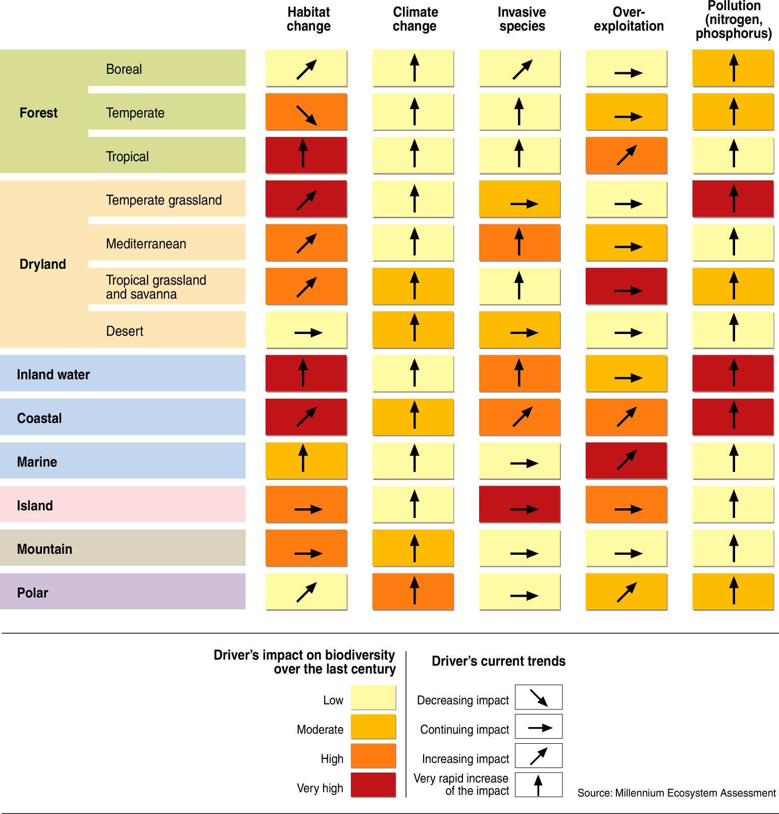
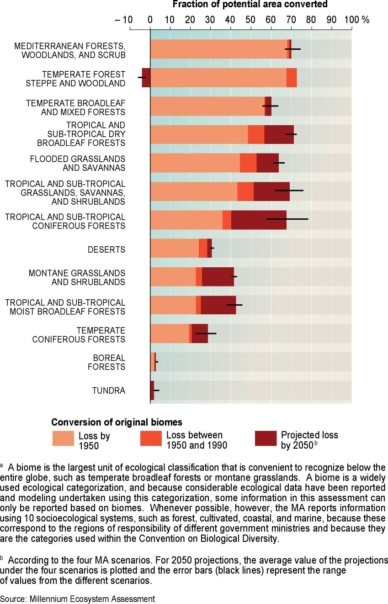
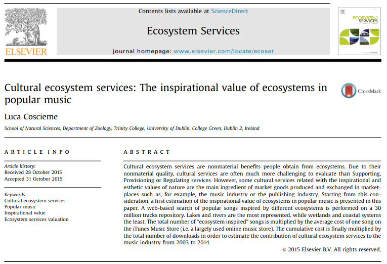
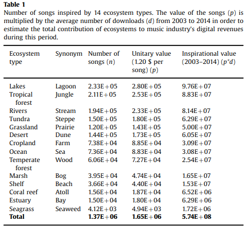

class: top, center

```{r setup, include=FALSE}
options(htmltools.dir.version = FALSE)
```

```{r webcam, echo=FALSE, include= TRUE}
xaringanExtra::use_webcam()
```

```{r xaringan_themes, echo = FALSE, include=FALSE}
	names(xaringan:::list_css())
```

```{r broadcast, echo=FALSE}
xaringanExtra::use_broadcast()
```

# Sumário

.left[
1. Resgate da aula anterior: Estrutura e funcionamento dos ecossistemas;

2. De onde vem a ideia de benefícios para as pessoas;

3. Relação da natureza com o bem estar humano;

4. O que são serviços ecosssitêmicos (SE);

3. Classificação dos SE;

4. Importância da conservação da natureza para os SE;

5. Valoração dos SE;

6. Pagamento por serviços ambientais (PSA);

7. Desserviços ecossistêmicos;

8. Atividade proposta.

]


???

Nesta aula abordaremos o conceito de serviços ecossistêmicos (SE).

Para isso faremos o resgate de alguns conceitos e ideias da aula passada sobre a Estrutura e Funcionamento dos Ecossistemas.
Apresentaremos a definição de serviços ecossistêmicos (SE) e a forma como são classificados. A seguir falaremos de algumas aplicações do conceito de SE, como valoração dos SE e ainda pagamento por serviços ambientais (PSA). Falaremos sobre os desserviços ecossistêmicos que é um conceito derivado de SE e que pode ser um pouco contraditório. Por fim, haverá uma atividade de fixação para ser realizada durante a semana e entregue na data da próxima aula via moodle. Esta atividade também terá caráter avaliativo e contribuirá com a nota final do aluno na disciplina.

---
class: top, center

# Resgatando conceitos

.left[

1. Ecosssitema;

2. Interações ecológicas;

3. Atributos funcionais;

4. Fluxos de massa e energia;

5. Propriedades emergentes.

]
 
```{r, include=TRUE, echo=FALSE, out.width="35%", fig.align='center'}
knitr::include_graphics("https://static.todamateria.com.br/upload/fa/to/fatoresbioticoseabioticos.jpg")
```
Simple matematical models with very complicated dynamics - Robert May (1976) - Nature

https://sci-hub.se/https://www.nature.com/articles/261459a0

???

Na aula passada, vimos que ecossistemas são um nível de organização ecológico dinâmico e complexo. Ele é complexo porque é formado por múltiplos elementos bióticos e abióticos (i.e. seres vivos e elementos não vivos) que interagem entre si. É dinâmico porque muda com o tempo. Estas interações são determinadas pelos atributos funcionais, que são características morfológicas, fisiológicas e comportamentais. Tamanho da nadadeira de um peixe é um atributo relacionado com sua mobilidade, por exemplo. A mobilidade vai determinar o tipo de alimento que o peixe vai conseguir capturar. Atributos fisiológicos também são importantes, como o metabolismo de substâncias tóxicas por animais e por plantas, que serão determinantes tanto para a sobrevivência de determinada espécie como para a recuperação de um ambiente degradado. Sendo assim, diferentes atributos vão permitir diferentes interações com o ambiente e com os outros seres vivos.

Da mesma forma que as condições do ambiente determinam a composição de atributos das espécies que formam um ecossistema, a composição de atributos também determina as condições abióticas locais. Por exemplo, as árvores são como bombas d'água naturais. Através de seus vasos, que vão das raízes até as folhas, elas tiram a água do solo e jogam para a atmosfera. É um processo passivo que depende basicamente da diferença de pressão entre as raízes e a superfície das folhas. Como as árvores não gastam energia, a eficiência no uso da água é bem baixa. Elas aproveitam, aproximadamente 5 % da água que elas retiram do solo, o resto é perdido para a atmosfera. A água "perdida" para a atmosfera será reciclada através de chuvas locais ou regionais e, parte dela, será reaproveitada pelas plantas. Sendo assim, os produtos da interação entre o solo, a atmosfera e as plantas vão depender de características das plantas, como por exemplo tamanho das folhas, espessura dos vasos, altura das árvores, entre outros. Desta forma, um local com mais espécies também terá uma maior diversidade de atributos funcionais, o que por sua vez permitirá uma maior interação entre os elementos do ecossistema e garantirá maior eficiência no aproveitamento dos recursos que culminará em maior variedade de funções ecossistêmicas e em mecanismos de auto regulação.

---
class: top, center

# Benefícios aos seres humanos!
### Mas de onde veio essa ideia?

- A ideia de SE surgiu na década de 1970, com o nome de *"serviços da natureza"* em um artigo publicado por Walter Westman, na Science, em 1977. https://sci-hub.se/https://science.sciencemag.org/content/197/4307/960


???

O ser humano é um ser natural, ou seja, ele é um ser que faz parte da natureza. Assim como os outros animais, ele depende das condições e recursos naturais para sobreviver. Estas condições e recursos como água potável, comida, oxigênio, solos férteis, clima regulado, ciclos biogeoquímicos balanceados, etc, são as funções do ecossistema, frutos das interações. 

A ideia de SE surgiu na década de 1970, com o nome de serviços da natureza em um artigo publicado por Walter Westman, na Science, em 1977.

---
class: top, left

# Reconhecimento da problemática ambiental

### Serviços ecossistêmicos dependem das interações que ocorrem nos ecossistemas íntegros.

- Ecologia + Economia

- Manifesto ecológico Brasileiro

.center[


]

???

Entretanto, a ideia de que a natureza suporta o bem estar humano já vinha sendo discutida há décadas sob o olhar utilitarista dos recursos naturais, principalmente após a segunda metade do século XX em que se intensificaram os impactos ambientais e os danos ficaram mais evidentes. No mesmo período, com o avanço da ciência ecológica, especialmente de estudos de ecossistemas, o valor intrínseco dos elementos da natureza e a sua importância para o ser humano também ganhou visibilidade. O conceito de serviços ecossistêmicos tem sua origem em duas disciplinas irmãs: economia e ecologia. As duas possuem o mesmo prefixo "eco" ou, do Grego "oikos", que significa "casa". Enquanto ecologia usa o sufixo "logia", que significa "estudo" ou "conhecimento", a economia usa "nomia", que quer dizer "organização" ou "gestão". Dessa forma, antes de gerir a casa, devemos conhecê-la. Gerir sem conhecer é arriscado, é como andar no escuro.

---
class: top, center

# Millenium Ecosystem assessment

- Acessa as consequencias das mudanças nos ecossistemas para o bem estar humano e qualidade de vida. (1360 especialistas em todo o mundo)

```{r echo=FALSE, out.width="59%", fig.align='center'}

```

Millennium Ecosystem Assessment: Ecosystems and human well-being: a framework for assessment: https://library.wur.nl/WebQuery/wurpubs/326575

???

O MEA foi criado com o objetivo de entender as consequencias das mudanças no ecossisema para o bem estar humano, visando a qualidade de vida. Foi uma iniciativa de produção e compilação de informações com a participação de mais de 1360 colaboradores.

---
class: top, left

# Mudanças e suas tendências

```{r echo=FALSE, out.width="57%", fig.align='center'}

```

---
class: top, center

# O que são serviços ecossistêmicos (SE)


.left[

- Propriedades emergentes dos ecossistemas;

- Benefícios diretos e indiretos proporcionados pela natureza ao seres humanos;

- Sustentam a vida humana e sua cultura.

]

```{r echo=FALSE, out.width="67%", fig.align='center'}
knitr::include_graphics("https://images.slideplayer.com/24/6937324/slides/slide_6.jpg")
```

???

Os chamados SERVIÇOS ECOSSISTÊMICOS são benefícios diretos e indiretos prestados ao ser humano pela natureza e são fundamentais para sobrevivência e cultura humana. Segundo o MEA (2005), os SE estão intimamente relacionados com o bem estar humano e com a qualidade de vida. 


---
class: top, left
# Relação da natureza com o bem estar humano

```{r figureES, include=TRUE, echo=FALSE, out.width="78%", fig.align='center', fig.pos='bottom'}
knitr::include_graphics("https://www.researchgate.net/publication/257744152/figure/fig3/AS:267815852703757@1440863683207/Millennium-ecosystem-assessment-MA-overview-diagram.png")
```


---
class: top, center

# Confusão de conceitos: 

.left[
- Lei Federal 14.119/21

- Contribuição da Natureza para as pessoas (BPBES)

- Consideração da diversidade de percepções e modelos culturais e sociais.
]


???

Há também grande discussão em relação ao termo serviços ambientais. Muitos autores costumam usar como sinônimo de serviços ecossistêmicos. Entretanto o MMA (2021) define serviços ambientais como ações por parte dos seres humanos para melhorar os serviços ecossitêmicos. É sempre bom atentar para definições.

---
class: top, center
# CLASSIFICAÇÃO DOS SEs

## Serviços de provisão

### Engloba elementos da natureza consumidos pelos seres humanos.

- Alimentos;

- Matérias primas;

- Combustíveis;

- Recursos medicinais;

- Água potável


???

Os serviços ecossistêmicos podem ser classificados de diferentes formas. O framework adotado pelo Millennium Ecosystem Assessment (MEA, 2005) e divide os serviços ecossistêmicos em quatro tipos: Serviços de provisão, serviços de regulação, serviços de suporte e serviços culturais. 

Os serviços de provisão são todos aqueles que provêm elementos utilizados pelo ser humano, como matérias primas, alimentos, água e medicamentos. 

---
class: top, center

# Serviços culturais

.left[
## Benefícios não materiais que os ecossistemas fornecem.

- Recreação;

- Turismo;

- Inspiração artística;

- Inspiração espiritual.]

.center[


]

???

 Os serviços culturais, são aqueles relacionados com a contemplação da paisagem, com recreação, com inspiração artística e influências religiosas. 

---
class: top, center

# Serviços de Regulação

.left[
## Englobam as funções ecossistêmicas que regulam as condições ambientais apropriadas para a existência e bem estar humano.


- Prevenção de erosão;

- Purificação da água;

- Controle de pragas

- Amortecimento de eventos climáticos extremos]


???

Os serviços de regulação garantem a regulação climática, regulação de doenças e a purificação da água.

---
class: top, center


# Serviço de Suporte

.left[
## São serviços necessários para que os outros serviços existam.

- Formação dos solos;

- Ciclagem de nutrientes;

- Produção de oxigênio;

- Polinização
]


???

Já os serviços de suporte, suportam todos os outros e são relacionados com a ciclagem de nutrientes, com a formação dos solos, dispersão de sementes e com a produtividade primária, por exemplo. 

---
class: top, center
# IPBES - Plataforma intergovernamental para a biodiversidade e serviços ecossistêmicos

- Criada em 2012 com a missão de estreitar a relação da ciência com as políticas de conservação da biodiversidade para o bem estar humano e desenvolvimento sustentável.


???

Atualmente, na esteira do MEA e IPCC, o IPBES (Plataforma Intergovernamental para a Biodiversidade e Serviços ecossistêmicos) é uma iniciativa internacional para estreitar a relação da ciência com políticas para conservação da biodiversidade ligados com o bem estar humano. O IPBES busca entender a contribuição da natureza para as pessoas e a interação das pessoas com a natureza para coprodução de serviços e para a sustentabilidade do bem estar humano. Por exemplo, comunidades de pescadores são um bom exemplo de interação complexa entre seres humanos e a natureza que determinam o bem estar humano através de formas específicas de manejo, disponibilidade de recursos e regras e instituições que regulam o acesso e distribuição dos recursos. A incorporação do conhecimento local e/ou tradicional na coprodução dos benefícios prestados pela natureza são fundamentais para a sustentabilidade dos SE, uma vez que padrões e processos são específicos de cada local e as formas de manejo devem se adequar a este contexto.


---
class: top, center

# BPBES: Plataforma brasileira para a biodiversidade e serviços ecossistêmicos.

- Adota conceitos, diretrizes e definições do IPBES para serem aplicados em diagnósticos em âmbito nacional.

- Orientação de políticas de conservação onde há conhecimento consolidado, com menor risco de incertezas. 


???

A plataforma brasileira para a biodiversidade e serviços ecossistêmicos é uma iniciativa brasileira que segue o framework proposto pelo IPBES com o intuito de diagnosticar a situação dos serviços ecossistêmicos e sua relação com o bem estar humano em âmbito nacional. Além disso, o BPBES orienta políticas de conservação baseadas nos relatórios e diagnósticos ancorados na ciência que têm a vantagem de diminuir as incertezas, o que aumenta a eficiência dos esforços de conservação, como por exemplo a aplicação de capital público.

---
class: top, left

# Valoração dos serviços ecossistêmicos

- Valoração: Estimativa da importância de algo (Constanza et al, 2017);


.center[


]

???

Baseado na visão utilitarista, alguns estudos propõem a valoração dos serviços ecossistêmicos para auxiliar os tomadores de decisão.

Valoração é a estimativa da importância de algo, mas nem sempre são baseadas em termos do capital. Imagine que você está caminhando no Cerrado em plena estação seca. O que vale mais, um copo d'água ou uma nota de 200 Reais?

Entretanto alguns serviços são difíceis de valorar, pois muitos não têm valor de mercado. 

 Há algumas abordagem para valorações desvinculadas do mercado do capital, como o Total Economic Value (TEV), que não necessariamente quantifica o valor total de um ecossistema, mas sim calcula o efeito das mudanças ambientais nos valores de uso e não uso para diferentes funções ecossistêmicas. Ele considera as escalas temporal e espacial e é muito caso-específico, não podendo ser generalizado.


---
class: top, left

# Valoração dos serviços ecossistêmicos


- Valor ecológico: Avaliação *não monetária* da integridade, saúde e ou resiliência de um ecossistema;

.center[
]

???

Há ainda argumentos de que o objetivo da valoração é quantificar a importância na mudança dos ecossistemas para a provisão de serviços essenciais ao bem estar humano. Só que o valor de algo é, também, relativo à cultura de cada local.  

---
class: top, left

# Valoração dos serviços ecossistêmicos

- Valor intrínseco: Valor que *independe da utilidade*;

.center[


]

---
class: top, left

# Valoração dos serviços ecossistêmicos

- Valor econômico: Relacionado com *utilidade e bem estar*. **Não necessariamente $**

- Dificuldade de valorar determinados serviços.

.center[
]

???

A valoração em termos do capital ainda pode ofuscar o valor intrínseco da natureza que não pode ser trocado por nenhuma moeda, uma vez que não produz por ele mesmo o essencial à vida humana. Da mesma forma, outros são difíceis de quantificar, como serviços culturais e contemplativos.

Ainda há muitos problemas a serem solucionados antes da valoração dos serviços ecossistêmicos. É preciso ter maior conhecimento das interações ecossistêmicas e de todos os elementos envolvidos para a emergência das suas funções. Além disso, o tamanho da área necessária para produzir e manter determinado serviço ecossistêmico é desconhecido. Se for valorar um ecossistema em termos de produtividade primária e biodiversidade, uma floresta tropical tem muito mais valor do que uma restinga. Entretanto, o papel da restinga na proteção costeira contra eventos extremos e erosão, no armazenamento de água, ciclagem de nutrientes e até na provisão de alimentos pode ser inestimável para o local. Dessa forma todos os ecossistemas são importantes e prestam serviços fundamentais para o ser humano de forma direta e indireta.

---
class: top, center

# Exemplo de valoração monetária

```{r echo=FALSE, out.width="37%", fig.align='center'}

```

```{r echo=FALSE, out.width="47%", fig.align='center'}

```

Cutural ecosystem services: The inspirational value of ecosystems in popular music: https://sci-hub.se/https://doi.org/10.1016/j.ecoser.2015.10.024 

???

A inspiração cultural ou artística, ou até mesmo, o simples uso contemplativo da paisagem dificilmente podem ser valorados. Estes desafios estimulam as mentes criativas a achar soluções, como neste artigo que eu trago para vocês (https://doi.org/10.1016/j.ecoser.2015.10.024). Neste artigo, o autor busca valorar o valor inspiracional dos diferentes ecossistemas por meio de plataforma de download de músicas. Primeiro, ele definiu palavras chave que identificam os diferentes tipos de ecossistemas e classificou as músicas por ecossistema. Então, ele analisou o valor de download de cada música e o número de downloads das músicas. Dessa forma, ele estimou o valor inspiracional de cada ecossistema. Claro que é uma estimativa, e pode ser melhorada, mas dá uma ideia do esforço neste tipo de valoração.

---
class: top, left

# Pagamento por serviços ambientais (PSA)

## É um instrumento econômico que recompensa em termos do capital, aqueles que produzem ou conservam os serviços ecossistêmicos.

- Lei Federal 14.119/21

**Serviços ambientais:** atividades individuais ou coletivas que favorecem a manutenção, a recuperação ou a melhoria dos serviços ecossistêmicos.

**Serviços ecossistêmicos:** benefícios relevantes para a sociedade gerados pelos ecossistemas, em termos de manutenção, recuperação ou melhoria das condições ambientais.

**Pagamento por serviços ambientais:** transação de natureza voluntária, mediante a qual um *pagador de serviços ambientais* transfere a um provedor desses serviços recursos financeiros ou outra forma de remuneração, nas condições acertadas, respeitadas as disposições legais e regulamentares pertinentes

???

Os estudos de valoração ambiental têm o propósito de serem aplicados na conservação. Pagamentos por serviços ambientais são mecanismos de proteção ambiental que garantem a integridade dos ecossistemas para produção de serviços através do estímulo financeiro ao não-uso ou uso "sustentável". Existem, na verdade, diversas modalidades, entre elas a que o governo paga pela utilização de métodos menos danosos ao ambiente. Por exemplo, a partir da estimativa da produção potencial de determinada área a ser conservada, o produtor é ressarcido por não utilizá-la. Entretanto, outros termos também são utilizados como sinônimo, como "compensação" ou "retribuição", mas possuem aplicações diferentes. Compensação e retribuição remetem a ideia de pagar para usar. Um exemplo são os famosos créditos de carbono. Recentemente, a Lei nº 14.119, promulgada em 13 de janeiro de 2021, institui a Política Nacional de Pagamentos por Serviços Ambientais (PNPSA).

---
class: top, center

# Desserviços ecossistêmicos
## São impactos causados ao bem estar humano por elementos e processos naturais.

- Custo de manutenção de áreas urbanas;

- Pragas em plantações;

- Doenças;

- Eventos climáticos extremos...


???

Há ainda um conceito derivado dos serviços ecossistêmicos, que é o desserviço ecossistêmico. Ele foca em elementos ou processos naturais que, de alguma forma, prejudicam os seres humanos. Há diversos exemplos, como picadas de insetos, pragas que causam prejuízos, doenças, plantas urticantes, sucessão primária nas áreas urbanas e que gera custos de manutenção...enfim, inúmeros exemplos.

---
class: top, center

## Soluções baseadas na Natureza para as cidades brasileiras: 

- Promover intervenções inspiradas em ecossistemas saudáveis para enfrentar desafios urgentes da sociedade, especialmente nas grandes metrópoles.


- Soluções Baseadas na Natureza (SBN) nas cidades brasileiras: https://www.bpbes.net.br/organizacoes-se-unem-para-estimular-uso-de-solucoes-baseadas-na-natureza-no-brasil/

???

Os outros animais, de uma geração para a outra, modificam quase nada suas formas de interagir com o ambiente. Modificações comportamentais podem ocorrer em escalas longas de tempo para se adaptar a mudanças graduais nas condições abióticas. Por outro lado, o ser humano incorpora em sua cultura conhecimentos científicos e tecnológicos que são passados de geração em geração. Sendo assim, há modificações constantes nas formas de manejar, extrair e utilizar os recursos naturais por parte do ser humano. Se não levarem em consideração os ciclos da natureza e sua capacidade de autoorganização, há séria ameaça à qualidade e quantidade de serviços ecossistêmicos disponíveis para as gerações futuras.

---
# Atividade proposta I
## Questão para reflexão:
- Você acredita que a tecnologia dá conta de suprir todas as nossas necessidades e substituir as funções vitais dos sistemas naturais?

- Responder em até 300 palavras.

.center[
]

---
# Atividade proposta II

- Explique brevemente o que são serviços ecossistêmicos. A seguir escolha um dentre os ecossistema da Ilha de Santa Catarina e verse sobre os SE associados. Explique como as interações dos elementos do ecossistema escolhido contribuem com a emergência, qualidade e quantidade dos SE. O texto deve ter no mínimo 300 palavras e no máximo 500. Obs: Usar fontes Liberation Sans ou Times New Roman, tamanho 12. Exemplos de ecossistemas da ilha: restinga, floresta atlântica, dunas, mangue, costão rochoso, laguna, lagoa, praia.

.center[
]

---
class: top, left

# Referências

- Artigo de Walter Westman (1977) - Science: https://sci-hub.se/https://science.sciencemag.org/content/197/4307/960

- Brazilian Platform on Biodiversity and Ecosystem Services: https://www.bpbes.net.br/

- Continued degradation of the environment increasing the likelihood of diseases spreading from animals to humans: UN Biodiversity Report - https://e-nnw.com/continued-degradation-of-the-environment-increasing-the-likelihood-of-diseases-spreading-from-animals-to-humans-un-biodiversity-report

- IPBES - Intergovernmental Plataform on Biodiversity and Ecosystem Services: https://ipbes.net/

- The IPBES Conceptual Framework — connecting nature
and people: https://ipbes.net/sites/default/files/downloads/pdf/Diaz_et_al._2015_IPBESConceptualFramework.pdf

- Lutzemberger Forever Gaia - Documentário completo: https://www.youtube.com/watch?v=-qaQE18VNgc

- Cutural ecosystem services: The inspirational value of ecosystems in popular music: https://sci-hub.se/https://doi.org/10.1016/j.ecoser.2015.10.024

- Millenium Ecosystem Assessment: https://www.millenniumassessment.org/en/index.html

---

Costanza, R. et al. The value of the world's ecosystem services and natural capital. Nature 387, 253-260 (1997).

Daily, G. C. et al. Ecosystem services: Benefits supplied to human societies by natural ecosystems. Issues in Ecology 2, 1-18 (1997).

MEA. Millennium Ecosystem Assessment: Ecosystems and Human Well-being: Synthesis. Washington, DC: Island Press, 2005.

Wall, D. H. ed. Sustaining Biodiversity and Ecosystem Services in Soils and Sediments. SCOPE 64 Washington, DC: Island Press, 2004.

https://www.sciencedirect.com/science/article/pii/S0959378010001172?casa_token=knqEYycmIygAAAAA:uDJSpaZVQBth6mMEiXQJ7hoIYWPU31fh2dBm_kADYriCVK69Rr0QeCZ7dnHwvErCQOxj3i-hhlI

https://www.cell.com/current-biology/pdf/S0960-9822(05)01029-8.pdf

https://epocanegocios.globo.com/Brasil/noticia/2019/02/estudo-estima-em-r-43-bilhoes-contribuicao-economica-dos-polinizadores.html

https://bv.fapesp.br/pt/auxilios/1025/biodiversidade-e-uso-sustentavel-de-polinizadores-com-enfase-em-abelhas-meliponini/
---

## Contato para críticas, dúvidas, sugestões e discussões:

- marciobcure@gmail.com

